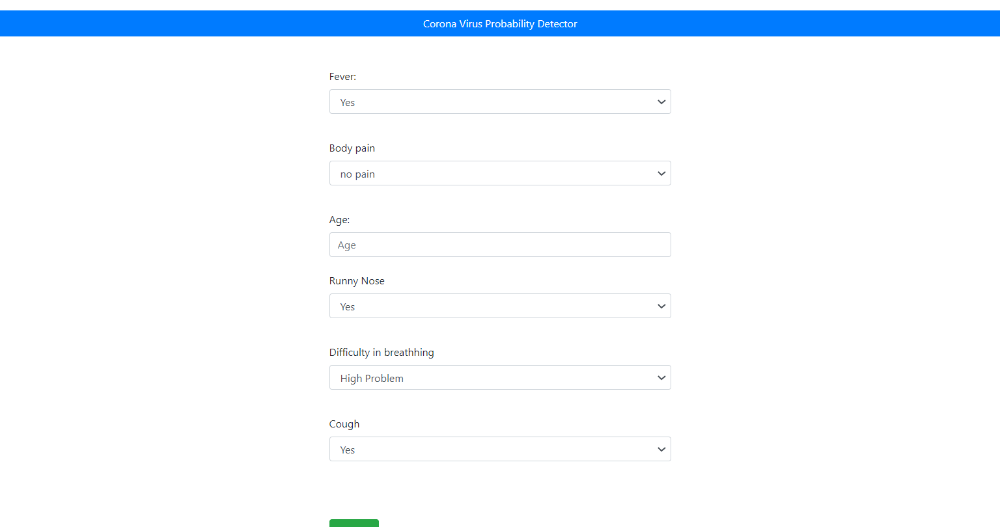
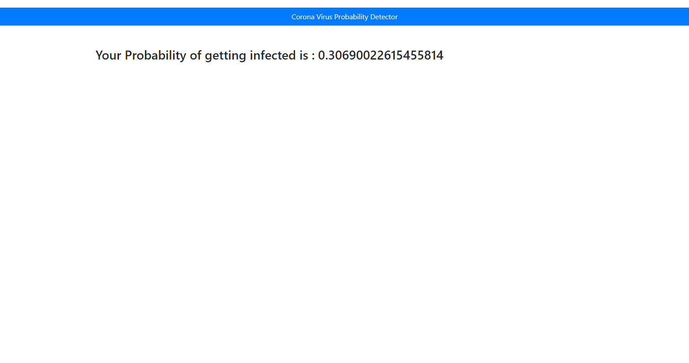

# COVID-19-Detection-using-ML/FLASK
+ Usages `python app.py`
## About
The cases for the patients affected by COVID-19 or Coronavirus is increasing at an exponential rate. This leads to an increase in the patients who have visible symptoms who need to be tested for the virus. The idea is to find out the probability/chance of a patient being affected by the the virus by comparing and analyzing the symptoms from the previous confirmed cases of virus-affected patients.

The patients who have a higher probability can be prioritized to have a checkup before the patients who have a lower probability. This measure will help detect positive cases in patients much faster than selecting and testing random patients.

## Requirements:-
`Flask==1.1.2`

`gunicorn==19.9.0`

`itsdangerous==1.1.0`

`Jinja2==2.11.2`<

`MarkupSafe==1.1.1`

`Werkzeug==1.0.1`

`numpy>=1.9.2`

`scipy>=0.15.1`

`scikit-learn>=0.18`

`matplotlib>=1.4.3`

`pandas>=0.19`

Project is written using VS Code in Azure ML studio, deployed over webapp using Continuous Deployment(CI/CD) pipeline via App Service Build Service.

## Dataset:-
The dataset used in this project is randomly generated and hence the predictions are not accurate. Using an actual dataset with real data involving affected patients will generate much better results. 

## Screenshots:-

